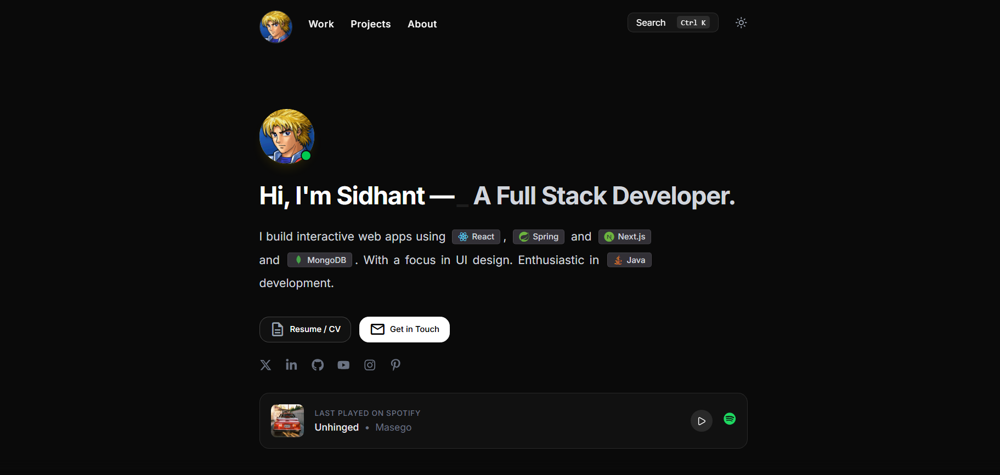

# sidxcode.me — Personal Developer Portfolio



[](https://sidxcode.me)
[](https://react.dev)
[](https://www.typescriptlang.org)
[](https://vite.dev)
[](https://tailwindcss.com)
[](https://pages.github.com)

A minimal, opinionated developer portfolio built with React 19 + TypeScript + Vite. Features dark/light theming, GSAP scroll animations, a live Spotify widget, real-time GitHub contribution heatmap, a command palette, and a working contact form — all without a dedicated backend.

**Live →** [sidxcode.me](https://sidxcode.me)

---

## Table of Contents

- [Features](#features)
- [Tech Stack](#tech-stack)
- [Project Structure](#project-structure)
- [Architecture & Data Flow](#architecture--data-flow)
- [Keyboard Shortcuts](#keyboard-shortcuts)
- [Getting Started](#getting-started)
  - [Prerequisites](#prerequisites)
  - [Installation](#installation)
  - [Environment Variables](#environment-variables)
  - [Run Locally](#run-locally)
- [Available Scripts](#available-scripts)
- [Deployment](#deployment)
- [Performance Notes](#performance-notes)
- [Design Decisions](#design-decisions)
- [Roadmap](#roadmap)
- [License](#license)

---

## Features

| Feature | Description |
|---|---|
| 🌓 **Dark / Light Theme** | Toggle with persistent preference via `localStorage` |
| ⌨️ **Command Palette** | `Ctrl+K` — searchable command palette powered by `cmdk` |
| 🎵 **Spotify Widget** | Last played track via Spotify Web API with inline embed toggle |
| 📊 **GitHub Activity** | Custom SVG heatmap via GitHub GraphQL API (no third-party widget) |
| 📬 **Contact Form** | Functional EmailJS form — zero backend required |
| ✨ **Scroll Animations** | GSAP ScrollTrigger + Framer Motion entrance transitions |
| 📱 **Responsive Layout** | Mobile-first, 760px max-width centered layout |
| 📄 **Resume Page** | Dedicated `/resume` route for sharing a live resume |
| 🔍 **SEO Ready** | Meta tags, OG image, semantic HTML, descriptive alt text |

---

## Tech Stack

| Layer | Technology |
|---|---|
| Framework | React 19, TypeScript 5.8 |
| Build Tool | Vite 6 |
| Styling | Tailwind CSS v4 |
| Animations | GSAP 3 (`ScrollTrigger`), Framer Motion (`motion`) |
| Routing | React Router v7 (`HashRouter` for GitHub Pages compatibility) |
| UI Primitives | Radix UI, shadcn/ui, `cmdk` |
| Icons | Lucide React, React Icons, Devicon, Tech Stack Icons |
| APIs | Spotify Web API (OAuth refresh token flow), GitHub GraphQL API |
| Email | EmailJS (`@emailjs/browser`) |
| Serverless API | Express (`api/` dir) for Spotify token proxy |
| Hosting | GitHub Pages via GitHub Actions CI/CD |

> **Why `HashRouter`?** GitHub Pages serves everything from a single static path. `HashRouter` avoids 404s on hard refresh by keeping routing client-side.

---

## Project Structure

```
sid folio/
├── .github/
│   └── workflows/
│       └── deploy.yml          — CI/CD: build & push to gh-pages branch
├── api/                        — Serverless Express handlers (Spotify proxy)
├── components/                 — Shared UI primitives (AnimatedContent, TextType, etc.)
├── public/
│   ├── images/                 — Avatar, project thumbnails, OG image
│   └── CNAME                   — Custom domain for GitHub Pages
├── scripts/                    — Helper scripts (e.g. get-spotify-token.mjs)
├── src/
│   ├── main.tsx                — Entry point, HashRouter setup
│   ├── App.tsx                 — Root: theme state, scroll restoration
│   ├── index.css               — Global styles, design tokens, Tailwind config
│   ├── components/
│   │   ├── Navbar.tsx          — Fixed nav: avatar, links, Ctrl+K search, theme toggle
│   │   ├── Hero.tsx            — Intro, social links, typing animation, Spotify widget
│   │   ├── Projects.tsx        — Project cards: thumbnails, tech badges, links
│   │   ├── Experience.tsx      — Work experience timeline
│   │   ├── About.tsx           — Bio card with skills grid
│   │   ├── GithubActivity.tsx  — SVG contribution heatmap (GitHub GraphQL)
│   │   ├── Contact.tsx         — Email form via EmailJS
│   │   ├── Footer.tsx          — Footer
│   │   └── ui/                 — Low-level primitives (BorderBeam, etc.)
│   ├── pages/
│   │   └── Resume.tsx          — Standalone resume view route
│   └── utils/
│       └── spotify.ts          — Token refresh + recently-played fetch
├── .env.example                — Template for required environment variables
├── vite.config.ts
└── tsconfig.json
```

---

## Architecture & Data Flow

### Spotify Widget

```
Browser → utils/spotify.ts
  └── POST https://accounts.spotify.com/api/token   (refresh_token grant)
  └── GET  https://api.spotify.com/v1/me/player/recently-played
  └── Returns { name, artist, albumArt, trackUrl, trackId }
  └── Inline Spotify embed iframe (toggled on Play click)
```

> ⚠️ The `client_secret` is embedded in the Vite build. For a production-hardened version, proxy the token exchange through a serverless function (see `/api` dir).

### GitHub Heatmap

```
Browser → GithubActivity.tsx
  └── POST https://api.github.com/graphql
        query: contributionsCollection (last 52 weeks)
  └── Renders custom SVG grid (no external widget dependency)
```

### Contact Form

```
Browser → Contact.tsx → @emailjs/browser
  └── Uses SERVICE_ID + TEMPLATE_ID to send email directly from the client
  └── No backend, no server — email arrives in your inbox via EmailJS relay
```

---

## Keyboard Shortcuts

| Shortcut | Action |
|---|---|
| `Ctrl + K` | Open command palette |
| `Esc` | Close command palette |
| `↑ / ↓` | Navigate palette results |
| `Enter` | Go to selected result |

---

## Getting Started

### Prerequisites

- **Node.js** v18 or higher
- **npm** v9 or higher

### Installation

```bash
git clone https://github.com/Sid-chou/portfolio.git
cd portfolio
npm install
```

### Environment Variables

Copy the example file and fill in your credentials:

```bash
cp .env.example .env
```

```env
# Spotify — https://developer.spotify.com/dashboard
VITE_SPOTIFY_CLIENT_ID=your_spotify_client_id
VITE_SPOTIFY_CLIENT_SECRET=your_spotify_client_secret
VITE_SPOTIFY_REFRESH_TOKEN=your_spotify_refresh_token

# GitHub — https://github.com/settings/tokens (scope: read:user)
VITE_GITHUB_TOKEN=your_github_personal_access_token

# EmailJS — https://www.emailjs.com/
VITE_EMAILJS_SERVICE_ID=your_emailjs_service_id
VITE_EMAILJS_TEMPLATE_ID=your_emailjs_template_id
VITE_EMAILJS_PUBLIC_KEY=your_emailjs_public_key
```

**How to get each credential:**

<details>
<summary>Spotify refresh token (step-by-step)</summary>

1. Go to [Spotify Developer Dashboard](https://developer.spotify.com/dashboard) → Create an app.
2. Set the redirect URI to `http://localhost:3000` (or any local URL).
3. Run `node scripts/get-spotify-token.mjs` and follow the prompts — it opens the OAuth flow and prints your `refresh_token`.
4. Paste the token into `.env`.

</details>

<details>
<summary>GitHub token</summary>

1. Go to [GitHub → Settings → Tokens (classic)](https://github.com/settings/tokens).
2. Generate a new token with the `read:user` scope.
3. Paste the token into `.env`.

</details>

<details>
<summary>EmailJS</summary>

1. Sign up at [emailjs.com](https://www.emailjs.com/).
2. Create an **Email Service** (Gmail, Outlook, etc.).
3. Create an **Email Template** — use `{{from_name}}`, `{{message}}`, `{{reply_to}}` variables.
4. Copy the **Service ID**, **Template ID**, and **Public Key** from the dashboard.

</details>

### Run Locally

```bash
npm run dev
```

App starts at `http://localhost:3000`.

---

## Available Scripts

| Script | Description |
|---|---|
| `npm run dev` | Start Vite dev server on port 3000 |
| `npm run build` | Production build to `dist/` |
| `npm run preview` | Preview production build locally |
| `npm run lint` | TypeScript type-check (`tsc --noEmit`) |
| `npm run clean` | Remove `dist/` directory |

---

## Deployment

Automated deployment to GitHub Pages via GitHub Actions on every push to `main`.

### How it works

1. Push to `main` → triggers `.github/workflows/deploy.yml`
2. Workflow: `npm install` → `npm run build` → deploy `dist/` to `gh-pages` branch
3. All `VITE_*` secrets are injected at **build time** from GitHub repository secrets

### First-time setup

1. **Settings → Pages** → source: **GitHub Actions**
2. **Settings → Secrets and variables → Actions** → add all `VITE_*` keys
3. Push to `main` — live in ~2 minutes

### Custom Domain

1. Put your domain in `public/CNAME` (one line, e.g. `sidxcode.me`)
2. Set DNS **A records** to GitHub Pages IPs:
   ```
   185.199.108.153
   185.199.109.153
   185.199.110.153
   185.199.111.153
   ```
3. Add a `CNAME` record: `www → <username>.github.io`
4. **Settings → Pages → Custom domain** → enter your domain, enable HTTPS
5. Ensure `vite.config.ts` has `base: '/'`

---

## Performance Notes

- **Images** are served as `.webp` for smaller payloads.
- **GSAP** animations use `ScrollTrigger` with `threshold: 0.1` — only fires when element enters viewport.
- **Spotify / GitHub** requests are made once on mount and are not polled.
- **`HashRouter`** means zero server-side routing config needed — all 404 handling is client-side.
- **Code splitting**: Vite auto-chunks vendor libraries. Resume page loads on-demand via its own route.

---

## Design Decisions

- **No UI framework components** for layout — raw Tailwind + CSS keeps the bundle lean.
- **`cmdk`** for the command palette instead of a custom implementation — battle-tested keyboard handling.
- **Custom SVG GitHub heatmap** instead of `react-github-calendar` — full control over colors and theme.
- **`HashRouter` over `BrowserRouter`** — works on GitHub Pages without a custom 404.html hack.
- **EmailJS** over a backend email handler — keeps the project fully static with no server cost.

---

## Roadmap

- [ ] Add `prefers-reduced-motion` support for all animations
- [ ] Lighthouse CI check in the GitHub Actions pipeline
- [ ] Blog / writing section (MDX)
- [ ] `/uses` page (tools, gear, setup)
- [ ] Swap client-side Spotify secret with a Vercel Edge Function proxy

---

## License

Open source — available for personal use and reference. If you fork this, a credit link back is appreciated.

---

Built by [Sidhant Choudhury](https://github.com/Sid-chou) · [sidxcode.me](https://sidxcode.me)
